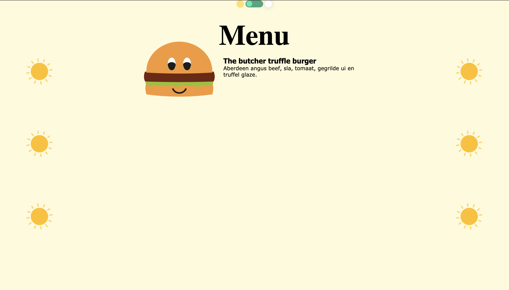
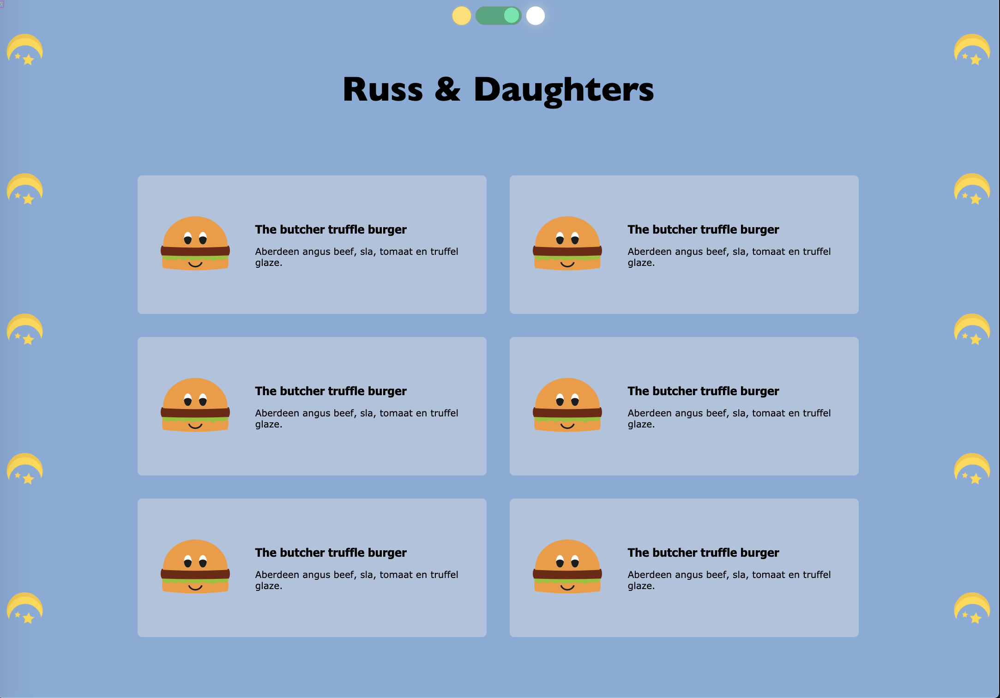

# CSS to the Rescue @cmda-minor-web 18-19

**Voor dit vak heb ik een interactieve menukaart gemaakt**

## Keuze opdracht

**Choose one asignment**

- [x] Responsive restauraunt menu Here’s some raw HTML you may use
- [ ] One art directed responsive web page for a magazine on the web. Here’s some example HTML
- [ ] Have a better idea? Nice! Pitch it to us.

**Context**
You have to add at least one extra context to your site

- [ ] Print-stylesheet
- [ ] Prefers-reduced-motion
- [x] Dark-mode
- [ ] Input type (pointer)
- [ ] <a href="https://developer.mozilla.org/en-US/docs/Web/CSS/Media_Queries/Using_media_queries">pick a better one</a>

**Pick two restrictions**
You have to work with _at least_ two of these restrictions.

- [x] When SVG meets CSS: Shapes / Masks / SVG
- [ ] Two colours
- [ ] Less than 5kb CSS _(not as an excuses for lazyness, hahaha)_
- [ ] No squares, no rectangles, no circles, no triangles
- [ ] Design must be visually appealing and it must meet <a href="https://www.w3.org/TR/WCAG20/#guidelines">Level AAA conformance</a> of the WCAG.
- [ ] Solar powered website
- [x] Responsive without media queries
- [ ] Design responds to weather/time
- [ ] Design responds to connectivity
- [ ] Design responds to battery level
- [ ] Design responds to language setting
- [ ] Design responding language setting / Japanese / English / Greek / Mongolian
- [ ] Create a great experience only with pop-ups, advertising banners and carousels!

**The _Selector First_ CSS Methodology**

You _have_ to work with the so called _Selector First_ CSS Methodology. This means that you _have to_ use a wide variety of CSS selectors. ID’s are only allowed to trigger the `:target` selector. If you really need them, you are allowed to use a few classes. In order to differentiate between

## Leerdoelen

- You understand the broader scope of CSS: You can show that CSS can be used for more than just styling web pages.
- You understand the progressive enhancement parts of CSS: You can show that you can use the cascade, inheritance and specificity in your project
- You understand the interactive parts of CSS: Is the UX fully enhanced within in given CSS scope?
- You have been experimenting: Have the learning goals been stretched?

## Concept

Mijn concept is een interactieve menukaart. Alle producten zijn interactief. Verder zullen de producten en het thema van de website aanpassen aan het weer buiten. Zodra het een zonnige dag is worden er andere producten weergegeven dan wanneer het een donkere regenachtige dag is.

## Leerproces

### Readme Opstellen

Als eerst moest ik deze readme opstellen, ik zag bij andere dat ze kopjes, linkjes en takenlijsten gebruikten. Ik had geen idee dus ik ben het volgende artikel gaan lezen en uitproberen.

**_Bron_**
[Basic writing and formatting syntax ](https://help.github.com/en/github/writing-on-github/basic-writing-and-formatting-syntax#paragraphs)

### CSS Animation Transform

Ik ben begonnen met het laten bewegen van een SVG zodra er overheen wordt gehovert. Dit heb ik gedaan doormiddel van keyframes, transform:rotate en transform:translatey. Ik had hier nog nooit mee gewerkt, dus dit heeft me zeker op weg geholpen. Verder heb ik nog even verder gelezen over de andere mogelijkheden, en die wil ik nog een keer gaan uitproberen, maar nu achterwegen gelaten omdat er nog zoveel andere selectoren zijn.

**_Bron_**
[CSS Animation](https://css-tricks.com/almanac/properties/a/animation/)

### Dark mode Switch button

Switch button met toggle
Als eerst begon ik met een switch button maken, hier heb ik een toggle voor gebruikt en gestylt met een trasistion.

**_Bron_**
[Switch button Day/Night](https://codepen.io/AngelaVelasquez/pen/cihEG)

### Target Selector

Ik wist nog niet zo goed hoe ik het moest aanpakken om de darkmodus toe te passen. Ik had hiervoor Bas om hulp gevraagd, en hij gaf aan dat ik hier de target selector kon gebruiken. Hij gaf aan dat ik een ID kon zetten op de Header. En door deze ID aan te roepen in een link die ik om de switch button had heen gezet, zou ik vervolgens met :target#header ~ body {} de body aanroepen waarin de data werd veranderd. Dit werkte niet omdat er iets mis ging met de link. De link gaf geen groote, ook niet als ik deze een styling gaf. Ik heb hulp gevraagd aan May (Studentassistent) en die gaf aan dat de checkbox hack hier een betere oplossing voor is. Dit ben ik gaan uitzoeken.

I'd use these rules-of-thumb for when :target is a good choice:

When a "state" is needed
When the jump-down/hash-link behavior is acceptable
When it's acceptable to affect the browser history

**_Bron_**
[Target Selector](https://css-tricks.com/almanac/selectors/t/target/)

### ::after ::before

In eerste instantie wilde ik voor dit probleem een ::after gebruiken. Toen ik me hierin ging verdiepen en het uitproberen kwam het erop neer dat dit niet de oplossing was. Maar ik wist nog niet hoe het werkte.

[::after ::before](https://css-tricks.com/almanac/selectors/a/after-and-before/)

### Checkbox hack

Toen ik de kleuren wilde aanpassen zodra de switch werd geselecteerd moest ik een checkbox hack gebruiken. Dit deed ik op de volgende manier:

input[type=checkbox]:checked ~ [full-background] {
background-color: #AFC2DD;}

    input[type=checkbox]:checked ~ main .sun {
        display: none;}

Het probleem was hiervoor dat de input type checkbox en de main niet dezelfde parent hadden. Dit kwam doordat er een div om de switch button heen zat, en de main hierbuiten viel. Hiervoor heb ik hulp gekregen van Daan Ronger (Studentassistent). Hij gaf aan dat het divje waar de switchbutton in stond ook om de main moest staan om dit probleem op te lossen.

Tot hier heb ik mij vooral gericht op het concept, en aan de hand van wat ik nodig had voor het concept, heb ik nieuwe CSS selectors geleerd. Vanaf nu wil ik het andersom gaan gebruiken, en in de lijst van CSS selectoren kijken en het gewoon uitproberen.

**_Bron_**
[Checkbox Hack](https://codepen.io/JiveDig/pen/jbdJXR/)

# SS Tricks Almanac

Vanaf dit moment ben ik de Almanac van CSS tricks gaan bekijken, en iets wat ik nog niet ken, en me interessant lijkt gaan uitproberen.

**_Bron_**
[CSS Tricks Almanac](https://css-tricks.com/almanac/)

## Customized Scrollbar

Als eerst had ik de Scrollbar uitgeprobeerd. Uiteindelijk is dit een best wel handige CSS selector om te leren. Het is niet moeilijk, maar kan de huisstijl van de website zeker verbeteren.

**_Bron_**
[Scrollbar CSS Tricks](https://css-tricks.com/almanac/properties/s/scrollbar/)

## Cursor

Je kunt de cursos vervangen voor bijna alles wat je kunt bedenken, een image, tekst, pijltje. In eerst instantie had ik een sterretje als afbeelding van mijn cursor gedaan, alleen dit is zo storend als je aan het werk bent, dat ik hem terug heb aangepast naar een pointer op de plekken waar dit nodig is.

Voor de ster had ik de volgende code gebruikt:
cursor: url(images/star.png), auto;

**_Bron_**
[Pointer CSS Tricks](https://css-tricks.com/almanac/properties/c/cursor/)

## Mix Blend Mode

Voor de mix blend mode heb je een hele boel verschillende mogelijkheden. Ik heb ze allemaal uitgeprobeerd, en vond de soft light het beste bij de website passen.

- inherit: an element will inherit the blend mode from its parent element.
- overlay: multiplies or screens the content depending on the background color. This is the inverse of the hard-light blend mode.
- darken: the background is replaced with the content where the content is darker, otherwise it is left as it was.
- lighten: the background is replaced with the content where the content is lighter.
- color-dodge: this attribute brightens the background color to reflect the color of the content.
  color-burn: this darkens the background to reflect the content’s natural color.
- hard-light: depending on the color of the content this attribute will screen or multiply it.
- soft-light: depending on the color of the content this will darken or lighten it.
  difference: this subtracts the darker of the two colors from the lightest color.
- exclusion: similar to difference but with lower contrast.
- hue: creates a color with the hue of the content combined with the saturation and luminosity of the background.
- saturation: creates a color with saturation of the content combined with the hue and luminosity of the background.
- luminosity: creates a color with the luminosity of the content and the hue and saturation of the background. This is the inverse of the color attribute.

**_Bron_**
[Mix Blend Mode CSS Tricks](https://css-tricks.com/almanac/properties/m/mix-blend-mode/)

## Takenlijst

- [x] Concept schrijven
- [x] Readme Opstellen
- [x] Criteria doorlezen
- [x] Nog een ristrictie uitwerken
- [ ] Geen classes
- [x] Responsive maken
- [ ] Readme bijwerken
