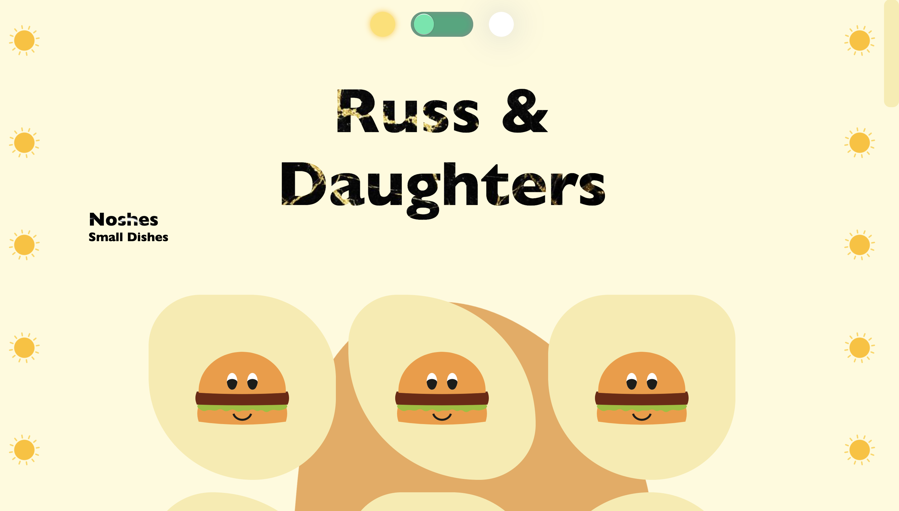

# CSS to the Rescue @cmda-minor-web 18-19

# Interactieve menukaart

## Live Demo

[Live Demo](https://zeijls.github.io/css-to-the-rescue-1920/)

## Inhoudspagina

- [Keuze odpracht](#Keuze-opdracht)
- [Leerdoelen](#Leerdoelen)
- [Eerste Conept](#Eerste-concept)
- [Leerproces](#Leerproces)

  - [Readme Opstellen](#Readme-opstellen)
  - [CSS Animation Transform](#CSS-Animation-Transform)
  - [Dark mode switch button](#Dark-mode-Switch-button)
  - [Target Selector](#Target-Selector)
  - [::after & ::before](#::after-::before)
  - [Checkbox Hack](#Checkbox-hack)
  - [CSS Tricks Almanac](#CSS-Tricks_Almanac)
  - [Customized Scrollbar](#Customized-Scrollbar)
  - [Cursor](#Cursor)
  - [Mix Blend Mode](#Mix-Blend-Mode)
  - [Blob](#Blob)
  - [Background Clip](#Background-Clip)
  - [Magic Randomisation](#Magic-Randomisation)
  - [Backfasce Visibility](#Backface-Visibility)

- [To do List](#To-do-List)
- [Credits](#Credits)
- [Nice to have](#Nice-to-have)

## Keuze opdracht

**Choose one asignment**

- [x] Responsive restauraunt menu Here’s some raw HTML you may use

**Context**
You have to add at least one extra context to your site

- [x] Dark-mode

**Pick two restrictions**
You have to work with _at least_ two of these restrictions.

- [x] When SVG meets CSS: Shapes / Masks / SVG
- [x] Responsive without media queries

**The _Selector First_ CSS Methodology**

Hiervoor heb ik veel gebruik gemaakt van nth-of-type() en child selectoren. Daarnaast heb ik ook een customized attribute toegepast. In je HTMl geef je een naam mee in bijvoorbeeld je section:

`<section voorbeeld> </section>`

Dit kun je op de volgende manier in je CSS aanroepen:

`[voorbeeld] {}`

## Leerdoelen

- You understand the broader scope of CSS: You can show that CSS can be used for more than just styling web pages.
- You understand the progressive enhancement parts of CSS: You can show that you can use the cascade, inheritance and specificity in your project
- You understand the interactive parts of CSS: Is the UX fully enhanced within in given CSS scope?
- You have been experimenting: Have the learning goals been stretched?

## Eerste Concept

Mijn concept is een interactieve menukaart. Alle producten zijn interactief. Verder zullen de producten en het thema van de website aanpassen aan het weer buiten. Zodra het een zonnige dag is worden er andere producten weergegeven dan wanneer het een donkere regenachtige dag is.

## Leerproces

### Readme Opstellen

Als eerst moest ik deze readme opstellen, ik zag bij andere dat ze kopjes, linkjes en takenlijsten gebruikten. Ik had geen idee dus ik ben het volgende artikel gaan lezen en uitproberen.

**_Bron_**
[Basic writing and formatting syntax ](https://help.github.com/en/github/writing-on-github/basic-writing-and-formatting-syntax#paragraphs)

### CSS Animation Transform

Ik ben begonnen met het laten bewegen van een SVG zodra er overheen wordt gehovert. Dit heb ik gedaan doormiddel van keyframes, transform:rotate en transform:translatey. Ik had hier nog nooit mee gewerkt, dus dit heeft me zeker op weg geholpen. Verder heb ik nog even verder gelezen over de andere mogelijkheden, en die wil ik nog een keer gaan uitproberen, maar nu achterwegen gelaten omdat er nog zoveel andere selectoren zijn.

**_Bron_**
[CSS Animation](https://css-tricks.com/almanac/properties/a/animation/)

### Dark mode Switch button

Switch button met toggle
Als eerst begon ik met een switch button maken, hier heb ik een toggle voor gebruikt en gestylt met een trasistion.

**_Bron_**
[Switch button Day/Night](https://codepen.io/AngelaVelasquez/pen/cihEG)

### Target Selector

Ik wist nog niet zo goed hoe ik het moest aanpakken om de darkmodus toe te passen. Ik had hiervoor Bas om hulp gevraagd, en hij gaf aan dat ik hier de target selector kon gebruiken. Hij gaf aan dat ik een ID kon zetten op de Header. En door deze ID aan te roepen in een link die ik om de switch button had heen gezet, zou ik vervolgens met :target#header ~ body {} de body aanroepen waarin de data werd veranderd. Dit werkte niet omdat er iets mis ging met de link. De link gaf geen groote, ook niet als ik deze een styling gaf. Ik heb hulp gevraagd aan May (Studentassistent) en die gaf aan dat de checkbox hack hier een betere oplossing voor is. Dit ben ik gaan uitzoeken.

I'd use these rules-of-thumb for when :target is a good choice:

When a "state" is needed
When the jump-down/hash-link behavior is acceptable
When it's acceptable to affect the browser history

**_Bron_**
[Target Selector](https://css-tricks.com/almanac/selectors/t/target/)

### ::after ::before

In eerste instantie wilde ik voor dit probleem een ::after gebruiken. Toen ik me hierin ging verdiepen en het uitproberen kwam het erop neer dat dit niet de oplossing was. Maar ik wist nog niet hoe het werkte.

[::after ::before](https://css-tricks.com/almanac/selectors/a/after-and-before/)

### Checkbox hack

Toen ik de kleuren wilde aanpassen zodra de switch werd geselecteerd moest ik een checkbox hack gebruiken. Dit deed ik op de volgende manier:

input[type=checkbox]:checked ~ [full-background] {
background-color: #AFC2DD;}

    input[type=checkbox]:checked ~ main .sun {
        display: none;}

Het probleem was hiervoor dat de input type checkbox en de main niet dezelfde parent hadden. Dit kwam doordat er een div om de switch button heen zat, en de main hierbuiten viel. Hiervoor heb ik hulp gekregen van Daan Ronger (Studentassistent). Hij gaf aan dat het divje waar de switchbutton in stond ook om de main moest staan om dit probleem op te lossen.

Tot hier heb ik mij vooral gericht op het concept, en aan de hand van wat ik nodig had voor het concept, heb ik nieuwe features van CSS geleerd. Vanaf nu wil ik het andersom gaan aanpakken, en in de lijst van CSS selectoren kijken wat me interessant lijkt en het gewoon gaat testen.

**_Bron_**
[Checkbox Hack](https://codepen.io/JiveDig/pen/jbdJXR/)

### CSS Tricks Almanac

Vanaf dit moment ben ik de Almanac van CSS tricks gaan bekijken, en iets wat ik nog niet ken, en me interessant lijkt gaan uitproberen.

**_Bron_**
[CSS Tricks Almanac](https://css-tricks.com/almanac/)

### Customized Scrollbar

Als eerst had ik de Scrollbar uitgeprobeerd. Uiteindelijk is dit een best wel handige CSS selector om te leren. Het is niet moeilijk, maar kan de huisstijl van de website zeker verbeteren.

**_Bron_**
[Scrollbar CSS Tricks](https://css-tricks.com/almanac/properties/s/scrollbar/)

### Cursor

Je kunt de cursos vervangen voor bijna alles wat je kunt bedenken, een image, tekst, pijltje. Ik heb mijn cursor aangepast naar een image. Dit was nog best wel even puzzelen tot dat ik erachter kwam dat de image maar 32 pixels groot mag zijn. Toen ik dit heb aangepast werkte het vrij snel en gemakkelijk.

**_Bron_**
[Pointer CSS Tricks](https://css-tricks.com/almanac/properties/c/cursor/)

### Mix Blend Mode

Voor de mix blend mode heb je een hele boel verschillende mogelijkheden. Ik heb ze allemaal uitgeprobeerd en gekeken wat er gebeurde. Hier was ook een handige codepen voor die het aangaf.

**_Bron_**
[Mix Blend Mode CSS Tricks](https://css-tricks.com/almanac/properties/m/mix-blend-mode/)
[Mix blend mode Codepen](...)

### Blob

Voor de blob had ik weer de CSS animaties nodig. Ik wilde dit uitproberen omdat ik dit veel bij andere zag en het me nog best een opgave leek. Ik had een codepen gevonden, waarbij eigenlijk meteen te zien was dat je de SVG een random scale geeft met een rotation. Ik heb de SVG uit de codepen gebruikt.

Nadat ik de blob had toegevoegd aan mijn website kreeg ik feedback van Vitally Friedman. Hem leek het wel cool als ik de blobs zou gebruiken om mn menu items weer te geven, om mezelf meer uit te dagen. Ik ben gaan uitzoeken hoe dit mogelijk is, en kom hierop terug bij de "Magic randomisation".

**_Bron_**

### Background Clip

**_Bron_**
[Background Clip](https://css-tricks.com/almanac/properties/b/background-clip/)

### Magic Randomisation

**_Bron_**
[Magic Randomisation](https://www.lottejackson.com/learning/nth-child-cicada-principle)

### Backface visibility

**_Bron_**
[Backface visibility](https://css-tricks.com/almanac/properties/b/backface-visibility/)
[Smashing Magazine](https://www.smashingmagazine.com/2020/02/magic-flip-cards-common-sizing-problem/)
[Codepen](https://codepen.io/j4rl/pen/jQrWME)

## Takenlijst

- [x] Concept schrijven
- [x] Assignment kiezen
- [x] Context uitwerken
- [x] Readme Opstellen
- [x] Criteria doorlezen
- [x] Ristricties uitwerken
- [x] Geen classes
- [x] Responsive maken
- [x] CSS onderzoeken dmv. Almanac CSS Tricks
- [x] Dark mode

## Credits

## Nice to have

- [ ] Random blobs die nog meer lijken te ademen
- [ ] Dat de prijs van het menu item op de blob wordt gesmashed
